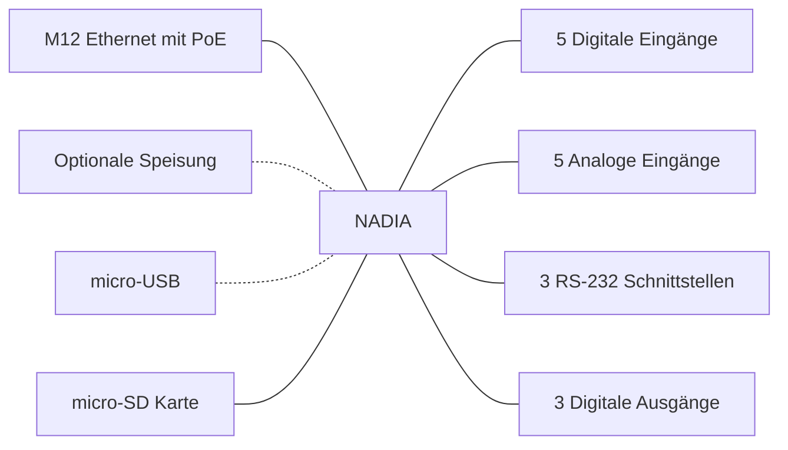
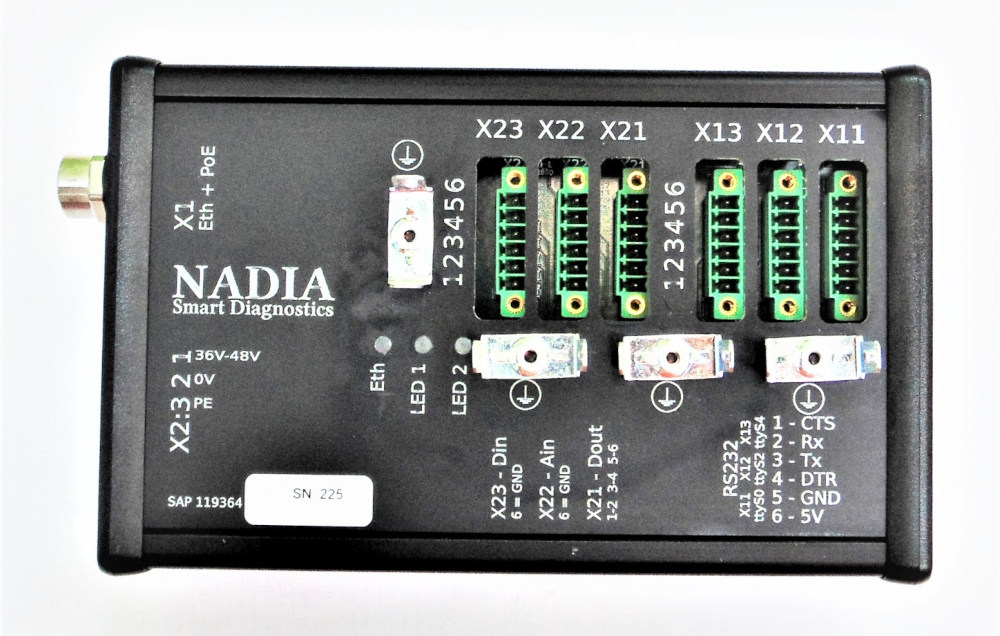
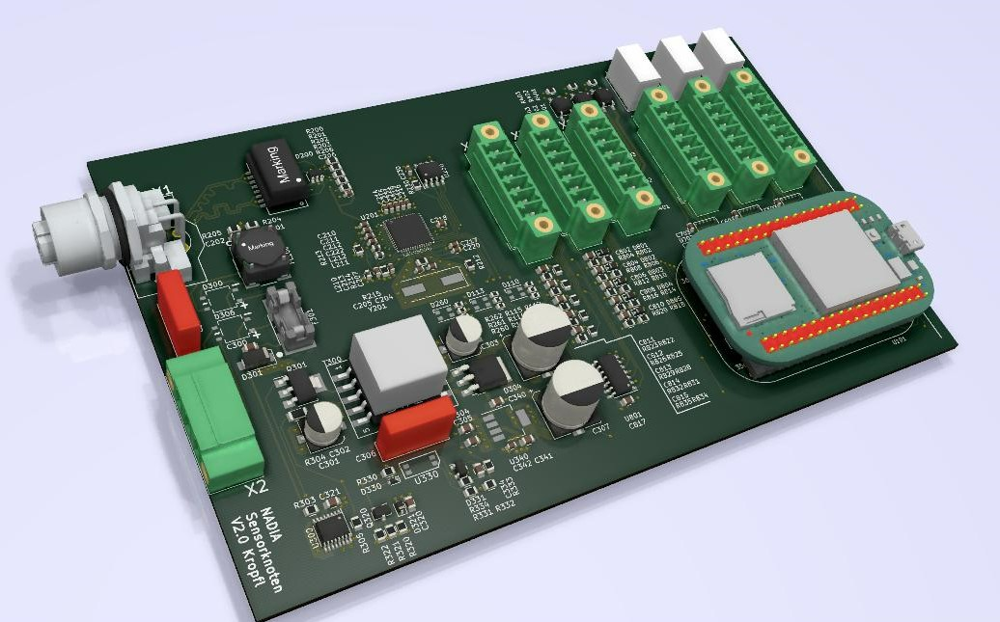

# NADIA - Hardware

- 3 galvanisch getrennte RS-232 Schnittstellen, [MAX33250EELC+](https://media.digikey.com/pdf/Data%20Sheets/Maxim%20PDFs/MAX33250E_51E_Rev1_Nov2018.pdf)
- 5 digitale Eingänge
- 5 analoge Eingänge
- 3 galvanisch getrennte Ausgänge (Solid State Relais, [G3VM-61GR2](https://omronfs.omron.com/en_US/ecb/products/pdf/en-g3vm_41gr8_61gr.pdf))
- Galvanisch getrennte PoE Speisung

## Übersicht

|NADIA im Gehäuse | NADIA PCB |
|-|-|
|  ||

## Rechnerplatine

| Wert                                      | Wert       | Einheit |
|:------------------------------------------|------------|---------|
| Rechnerplatine  [Pocketbeagle](https://beagleboard.org/pocket)                          |  |   -    |
| RAM                                       |  512       | MB,  DDR3 RAM|
| CPU  [Octavo Systems OSD3358-SM](http://octavosystems.com/octavo_products/osd335x-sm/)          |  1         | GHz           |
| Speicher                                  |  -         | microSD       |

## Elektrische Charakteristik

| Wert                                      | Min  | Typisch  | Max       | Einheit |
|:------------------------------------------|------|:--------:|-----------|---------|
| Speisung Spannung                         | 36   | 48       | 56        | VDC       |
| Speisung Strom                            |      | 50       | 100       | mA      |
| Galvanische Trennung Speisung             |      |          | 1.5       | kV      |
| **Digitaler Eingang**                     |
| Schmitt-Trigger [74HC7014D](https://www.mouser.ch/datasheet/2/916/74HC7014-1598223.pdf)    |
| Digitaler Eingang Pegel High              |      | 4        |           | VDC       |
| Digitaler Eingang Pegel Low               |      | 3.8      |           | VDC       |
| Digitaler Eingang maximale Spannung       | -100 |          | 100       | VDC       |
| Digitaler Eingang Eingangswiderstand      | 560  |          | 660       | kΩ      |
| **Analoger Eingang**                      |
| Spannungsteiler mit Widerständen|
| Analoger Eingang maximale Spannung        | -100 |          | 100       | VDC       |
| Analoger Eingang Messbereich / V          | 0    |          | 50        | VDC       |
| Analoger Eingang Eingangswiderstand       | 560  |          | 850       | kΩ      |
| Analoger Eingang Bandbreite -3dB          |      | 300      |           | Hz      |
| **Digitaler Ausgang**                     |
| Solid State Relais [G3VM-61GR2](https://omronfs.omron.com/en_US/ecb/products/pdf/en-g3vm_41gr8_61gr.pdf) |
| Digitaler Ausgang Spannung                |      |          | 60        | Vpeak AC/DC   |
| Digitaler Ausgang Strom                   |      |          | 1.7       | A       |
| Digitaler Ausgang Schaltfrequent          |      |          | 10        | Hz      |
| Digitaler Ausgang Isolationsspannung      |      |          | 1.5       | kV_rms  |
| **RS-232 Schnittstelle**                  |
| Treiber  [MAX33250EELC+](https://media.digikey.com/pdf/Data%20Sheets/Maxim%20PDFs/MAX33250E_51E_Rev1_Nov2018.pdf)| ||||
| RS-232 Schnittstelle Galvanische Trennung |      | 200      | 600 @ 60s | Vrms    |
| RS-232 ESD Schutz                         |      |          | ±15       | kV      |
| RS-232 Eingangswiderstand                  | 3    | 5        | 7         | kΩ      |
| RS-232 Eingangsspannung                    |      |          | ±25       | V       |
| RS-232 Ausgangsspannung                   |      | ±5 @ 3kΩ | ±13.2     | V       |
| RS-232 Ausgangskurzschlussstrom          |      |          | ±70       | mA      |

## Konnektivität

### Ethernet

Die Ethernetverbindung wird NADIA intern über einen USB-Ethernet Wandler sichergestellt, dem [LAN9500A von Microchip](https://www.microchip.com/en-us/product/LAN9500A).

Über Ethernet kann auf alle Dienste von NADIA zugegriffen werden.

### Micro USB

Auf NADA kann über die Micro USB Schnittstelle zugegriffen werden. NADIA erstellt über USB eine virtuelle Ethernet-Verbindung her.
Mehr Details siehe die Dokumentation von Beagleboard Pocketbeagle:

- [Getting Started - Enable a network connection](https://beagleboard.org/getting-started#step2)
- [Pocketbeagle System Reference Manual](https://github.com/beagleboard/pocketbeagle/wiki/System-Reference-Manual#533-usb-20-connector)

Über USB kann auf alle Dienste von NADIA zugegriffen werden.

### Wireless

NADIA verfügt über keine Wireless Kommunikationsmöglichkeiten.

### CAN

NADIA verfügt in dieser Version über **kein** CAN.
Allerdings verfügt das Pocketbeagle über die Möglichkeit zwei CAN Schnittstellen anzubinden. Dies würde ein neues PCB-Layout voraussetzen.

### Serial RS232

Die drei seriellen Schnittstellen sind jeweils galvanisch getrennt von der Speisung. Aus Sicherheitsgründen müssen die Schnittstellen über einen GPIO Pin freigeschaltet werden, bevor sie benutzt werden können.

## Software

Als Basisimage dient das Image von Pocketbeagle:
[AM3358 Debian 10.3 2020-04-06 4GB SD IoT](https://beagleboard.org/latest-images)
Um einen zuverlässigen Betrieb sicherzustellen, ist die Erstellung von verschiedenen Partitionen nötig. Die Systempartition in ReadOnly.

[Node-RED](https://nodered.org/) wird für das eigentliche Programmieren verwendet.
Mit Node-RED können auch sehr einfach ansprechende GUIs erstellt werden.

Auf NADIA, respektive dem PocketBeagle, ist auch jede andere ARMHF Linux Software lauffähig.

Beispiele: (jedoch noch keine Erfahrung)

- [OpenPLC](https://www.openplcproject.com/)
- [4DIAC](https://www.eclipse.org/4diac/)

# Licence

Copyright Lukas Kropf 2022.

This source describes Open Hardware and is licensed under the CERN-OHL-W v2  or later.

You may redistribute and modify this documentation and make products
using it under the terms of the CERN-OHL-W v2 (https:/cern.ch/cern-ohl).

This documentation is distributed WITHOUT ANY EXPRESS OR IMPLIED
WARRANTY, INCLUDING OF MERCHANTABILITY, SATISFACTORY QUALITY
AND FITNESS FOR A PARTICULAR PURPOSE. 
Please see the CERN-OHL-W v2 for applicable conditions.

Source location: https://github.com/LukasKropf/nadia-hardware

As per CERN-OHL-W v2 section 4.1, should You produce hardware based on
these sources, You must maintain the Source Location visible on the
external case of NADIA-Hardware or other product you make using
this documentation.
